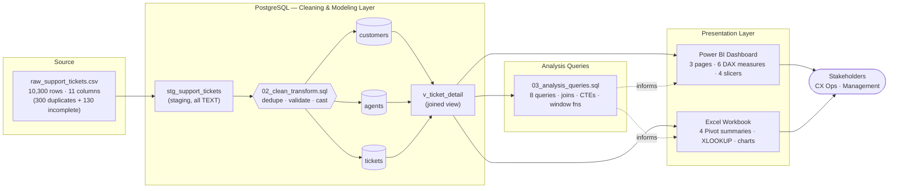
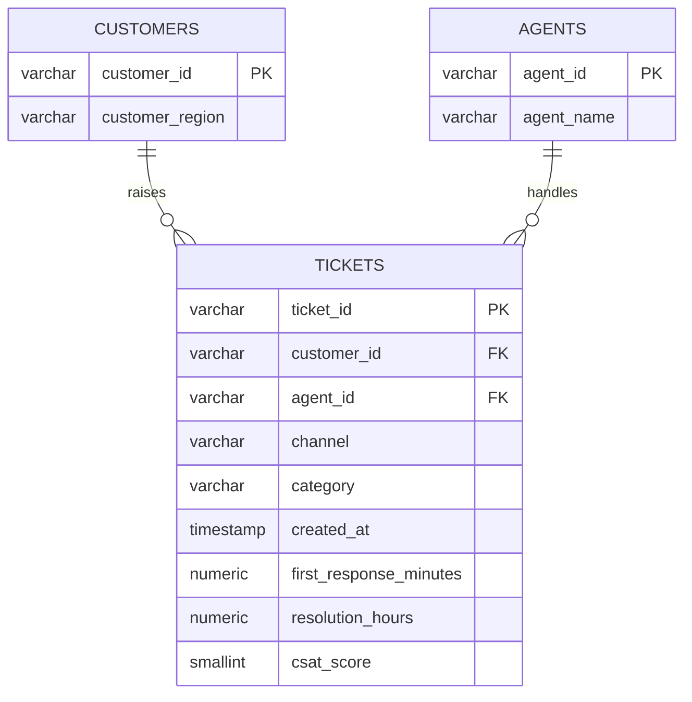

# 📊 Customer Experience (CX) Analytics Dashboard

<p align="left">
  
  
  
  
  
</p>

An end-to-end CX (Customer Experience) analytics pipeline — from a raw, duplicate-riddled support
ticket export, through a PostgreSQL cleaning and modeling layer, to an interactive 3-page
dashboard and an Excel workbook for offline analysis. Built to demonstrate the full analyst
workflow: **ingest → clean → model → analyze → visualize → communicate.**

**🔗 [View the live interactive dashboard](powerbi/dashboard.html)** &nbsp;·&nbsp;
**📁 [Data Dictionary](docs/data_dictionary.md)** &nbsp;·&nbsp;
**🧮 [SQL Logic](docs/sql_logic.md)** &nbsp;·&nbsp;
**📈 [DAX Measures](docs/dax_measures.md)**

---

## Table of Contents

- [Problem Statement](#problem-statement)
- [Architecture](#architecture)
- [Data Model (ERD)](#data-model-erd)
- [Key Insights](#key-insights)
- [Dashboard](#dashboard)
- [Repository Structure](#repository-structure)
- [Tech Stack](#tech-stack)
- [Getting Started](#getting-started)
- [Methodology & Data Notes](#methodology--data-notes)
- [Future Improvements](#future-improvements)
- [Author](#author)

---

## Problem Statement

Support teams generate ticket data continuously, but raw exports are rarely analysis-ready —
duplicate entries, incomplete records, and flat, unnormalized structures make trustworthy
reporting difficult. This project simulates that exact situation: a 10,300-row ticket export with
300 duplicate rows and 130 incomplete records, and builds the full pipeline needed to turn it into
a reliable, decision-ready reporting layer.

**Business question answered:** *Where is ticket volume concentrated, and does resolution speed
actually affect customer satisfaction — and if so, where should the team intervene first?*

## Architecture

The project follows a standard analytics-engineering flow: a single source of raw data feeds a
SQL cleaning/modeling layer, which in turn feeds two presentation layers aimed at different
audiences.



**Design rationale:**
- **Staging table is all-`TEXT`** so a messy load never fails on a type mismatch — casting and
  validation happen deliberately in SQL, not silently at import.
- **Cleaning is a two-stage CTE pipeline** (dedupe via `ROW_NUMBER() OVER (PARTITION BY ticket_id)`,
  then drop-incomplete), so the two causes of data loss stay independently auditable (300 vs. 130
  rows), instead of one opaque "rows removed" number.
- **Two presentation layers, one source of truth** — Power BI for interactive, filterable
  exploration; Excel for stakeholders who live in spreadsheets. Both read from the same cleaned
  model, so the numbers never diverge.

## Data Model (ERD)

Normalized into 3 related tables to eliminate redundancy (an agent's name is stored once, not
once per ticket) and enforce referential integrity.



Full field-level documentation: [`docs/data_dictionary.md`](docs/data_dictionary.md)

## Key Insights

| Finding | Detail |
|---|---|
| 🗨️ **Chat dominates volume** | **34.3%** of all tickets arrive via Chat — the single largest intake channel |
| ⏱️ **Speed drives satisfaction** | Tickets resolved **within 24h** average **4.03 CSAT**; tickets resolved **after 24h** drop to **2.90** — a **28.1%** decline |
| 🎯 **Where SLA breaks down most** | **Refund (29.0%)** and **Technical Issue (26.8%)** tickets breach the 24-hour mark most often |
| 📌 **Recommendation** | Prioritize faster-resolution workflows — auto-routing and staffing adjustments — for Refund and Technical Issue tickets, and for Email, the slowest channel by first-response time |

Full talk track for presenting these to non-technical stakeholders:
[`docs/stakeholder_walkthrough_script.md`](docs/stakeholder_walkthrough_script.md)

## Dashboard

Three report pages, four slicers (Channel, Category, Region, Month), six DAX measures:

| Page | What it shows |
|---|---|
| **Overview** | KPI cards, monthly ticket volume trend, CSAT by resolution bucket, channel/category breakdowns |
| **Channel & Category** | Top categories per channel, SLA-breach rate by category, regional CSAT vs. company average, channel × resolution-time heat-map |
| **Agent Performance** | Ranked agent leaderboard with CSAT quartiles |

👉 Open [`powerbi/dashboard.html`](powerbi/dashboard.html) directly in a browser — no install required.

> A native `.pbix` can only be authored inside Power BI Desktop. This HTML report is a faithful,
> interactive reproduction of the same model, measures, and numbers — see
> [`docs/dax_measures.md`](docs/dax_measures.md) for the exact DAX to rebuild it natively.

## Repository Structure

```
.
├── data/
│   ├── generate_data.py            # Seeded synthetic data generator (reproducible)
│   ├── raw_support_tickets.csv     # 10,300 rows, 11 columns (as extracted)
│   ├── clean_support_tickets.csv   # 9,870 rows, cleaned and validated
│   ├── dim_customers.csv
│   ├── dim_agents.csv
│   └── fact_tickets.csv
│
├── sql/
│   ├── 01_schema.sql                # Staging table + normalized schema
│   ├── 02_clean_transform.sql       # Load → profile → dedupe → normalize → validate
│   └── 03_analysis_queries.sql      # 8 queries: joins, CTEs, window functions
│
├── powerbi/
│   └── dashboard.html               # 3-page interactive report
│
├── excel/
│   └── CX_Analytics_Workbook.xlsx   # Pivot summaries, agent lookup, insights
│
├── docs/
│   ├── data_dictionary.md
│   ├── sql_logic.md
│   ├── dax_measures.md
│   ├── dashboard_usage_guide.md
│   └── stakeholder_walkthrough_script.md
│
└── README.md
```

## Tech Stack

| Layer | Tools |
|---|---|
| **Data generation** | Python (pandas, numpy) |
| **Data warehousing & ETL** | PostgreSQL — staging tables, CTEs, window functions, views |
| **BI / Visualization** | Power BI (DAX, data modeling, slicers) |
| **Spreadsheet analysis** | Advanced Excel — Pivot Tables, XLOOKUP/INDEX-MATCH, SUMIFS/COUNTIFS/AVERAGEIFS |
| **Documentation** | Markdown |

## Getting Started

```bash
# 1. Regenerate the dataset (optional — CSVs are already committed)
python3 data/generate_data.py

# 2. Load and transform in PostgreSQL
createdb cx_analytics
psql -d cx_analytics -f sql/01_schema.sql
psql -d cx_analytics -f sql/02_clean_transform.sql
psql -d cx_analytics -f sql/03_analysis_queries.sql

# 3. Explore the dashboard
open powerbi/dashboard.html

# 4. Review the Excel workbook
open excel/CX_Analytics_Workbook.xlsx
```

Full setup — including how to rebuild this as a native Power BI `.pbix` — is documented in
[`docs/dashboard_usage_guide.md`](docs/dashboard_usage_guide.md).

## Methodology & Data Notes

- The dataset is **synthetically generated** by a seeded Python script (`data/generate_data.py`,
  `seed=42`), so every number across the SQL output, Excel workbook, and dashboard is fully
  reproducible and internally consistent. This project demonstrates the pipeline end-to-end on
  realistic, representative data rather than a real company's production data.
- SQL logic covers multi-table joins, CTEs, and window functions (`ROW_NUMBER`, `RANK`, `LAG`,
  `NTILE`, `FILTER`) — full breakdown in [`docs/sql_logic.md`](docs/sql_logic.md).
- The Power BI data model, all 6 DAX measures, and native `.pbix` rebuild steps are documented in
  [`docs/dax_measures.md`](docs/dax_measures.md).
- Excel pivot summaries are formula-driven (`SUMIFS`, `COUNTIFS`, `AVERAGEIFS`, `INDEX`/`MATCH`)
  against a structured Excel Table (`tbl_Clean`), so every figure recalculates automatically — see
  the workbook's own `ReadMe` tab for the one-click path to native PivotTables.

## Future Improvements

- Connect to a live/real ticketing data source (e.g. Zendesk, Freshdesk API) instead of a static CSV
- Add time-series forecasting for ticket volume (e.g. Prophet) to support staffing decisions
- Add agent-level drill-through in Power BI for manager-facing views
- Automate the PostgreSQL → Power BI refresh with a scheduled pipeline

## Author

**Sumit Kumar Gupta**
B.E. Computer Science (Data Science), Acharya Institute of Technology, Bangalore
[GitHub](https://github.com/sumit-kumar-guptaa) · [LinkedIn](https://linkedin.com/in/sumit-kumar-9b4970285)

---

<p align="center"><sub>Built as part of a data analytics portfolio, demonstrating SQL-based ETL, dimensional data modeling, DAX/BI reporting, and Excel-based stakeholder communication.</sub></p>